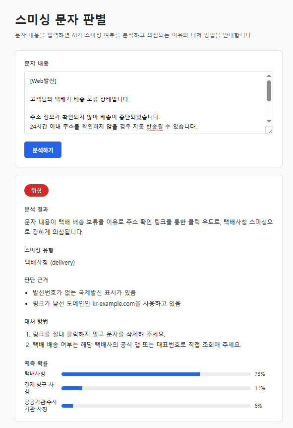

# Smishing Guard

경량 ML 모델(KLUE-BERT)과 LLM(GPT-3.5)을 결합하여, 사용자가 입력한 문자 메시지의 스미싱 여부를 판단하고 유형별 맞춤형 대처 가이드를 제공하는 보안 보조 서비스입니다.

---

## 실행 화면



- **위험도 판별**: 분석 결과에 따른 위험 단계 (위험 / 주의 / 안전) 시각화
- **실시간 사기 유형 판별**: BERT 모델의 예측 확률 분포를 바 차트로 시각화
- **판단 근거 및 대처 가이드**: RAG로 검색된 공식 대처 문서 기반 가이드 제공

---

## Key Technical Decisions

### 1. Hybrid 2-Stage Pipeline (비용 및 속도 지연 최적화)
- **Problem**: 모든 문자 분석을 LLM API에 직결할 경우 처리 속도 지연과 API 비용 부담이 발생함.
- **Solution**: 
  - **1차 (Fast Path)**: Fine-tuned KLUE-BERT가 문자를 1차 분류 및 확률 분포 계산.
  - **2차 (Deep Analysis)**: BERT가 판별한 라벨 정보만 타겟팅하여 ChromaDB에서 대처 문서를 RAG 검색하고, 이를 기반으로 LLM이 최종 검증 및 맞춤형 행동 가이드 생성.
- **Result**: 불필요한 토큰 소모를 방지하고, 검색 노이즈를 최소화하여 정확도와 응답 속도를 동시 확보.

### 2. Single Source of Truth 기반 모듈화 설계
- **Problem**: 스미싱 유형이 추가/수정될 때 ML, Vector DB, LLM 프롬프트, API, UI 코드를 각각 수정하면서 발생하는 동기화 오류 위험.
- **Solution**: 
  - common/labels.py에 라벨 키, 한국어명, 프롬프트 설명, 룰베이스 키워드를 단일 공급원으로 관리.
  - 새 사기 유형 추가 시 labels.py 수정만으로 학습 데이터 로더, Vector DB 색인기, LLM 프롬프트 템플릿이 자동 동기화되는 Decoupled 구조 구축.

---

## 트러블슈팅

### 1. BERT 1·2순위 예측 확률이 근소한 경우 (애매한 분류)
- **Problem**: 문맥이 겹치는 유형(예: 공공기관 사칭 vs 금융·대출 사기) 사이에서 BERT가 확신 있게 1위를 정하지 못하는 경우가 존재. 1순위 라벨만 믿고 RAG 검색하면 실제로는 2순위 라벨의 대처 문서가 더 적절한 상황에서도 이를 놓치는 문제 발생.
- **Solution**: `common/classification.py`에 `is_ambiguous(distribution, confidence_threshold=0.45, gap_threshold=0.15)` 헬퍼 추가. 1순위 confidence가 threshold 미만이거나 1·2순위 score 차이가 gap_threshold 미만이면 애매한 케이스로 판단하고, 1순위·2순위 라벨 양쪽에서 `top_k`를 절반씩 나눠 RAG 검색 후 결과를 합쳐 LLM에게 제공. SYSTEM_PROMPT에도 "두 후보 유형의 참고자료가 함께 제공되는 경우 문맥으로 직접 판단하라"는 지침을 추가.
- **Result**: BERT의 근소한 오분류를, LLM이 두 후보의 실제 근거 문서를 비교하며 스스로 보정할 수 있게 됨.

### 2. 1순위가 "정상 문자(normal)"인데 2순위와 근소한 차이라 대처 안내가 부실한 경우
- **Problem**: `normal` 라벨은 knowledge base에 대응 문서가 없어, BERT 1순위가 normal로 나오면 2순위 사기 라벨과 점수 차이가 크지 않아도 RAG 검색 자체가 스킵됨. 결과적으로 실제로는 사기 문자인데 LLM이 참고자료 없이 판단만 뒤집고, 공식 대처 가이드(신고 절차 등) 없이 일반론만 안내하는 문제.
- **Solution**: `analyze()`에서 1순위가 normal이면서 `is_ambiguous()`가 True이고 2순위가 normal이 아닌 경우를 별도 분기로 처리. 이때는 2순위(의심 사기 유형) 라벨로 RAG 검색을 수행해 LLM에게 근거 문서를 제공.
- **Result**: BERT가 근소한 차이로 "정상"에 걸쳐 있는 실제 사기 문자도, 2순위 라벨의 공식 대처 문서를 근거로 구체적인 행동 가이드를 받을 수 있게 됨.

---

## 아키텍처 및 처리 흐름

1. **[사용자]** 문자 메시지 입력
2. **[ml_model]** KLUE-BERT 파인튜닝 모델
   - 1차 유형 분류 및 확률 분포 계산
3. **[vector_db]** ChromaDB Retriever
   - 분류된 라벨 메타데이터 기반 대처 문서 RAG 검색
4. **[llm]** OpenAI Agent (gpt-3.5-turbo)
   - 근거 기반 최종 verdict(위험/주의/안전) 및 행동 가이드 생성
5. **[backend/frontend]** FastAPI 및 Express Web UI를 거쳐 화면 출력

---

## 프로젝트 구조

- **common/**: [SSOT] 라벨 정의 및 공통 환경 설정 (전체 모듈 참조)
- **data/**: 학습용 raw 데이터셋 및 유형별 대처방법 지식 문서
- **ml_model/**: KLUE-BERT 파인튜닝(train.py) 및 추론 인터페이스(classifier.py)
- **vector_db/**: 지식 문서 청킹, 임베딩, ChromaDB 색인/검색 래퍼
- **llm/**: OpenAI 에이전트 및 프롬프트 템플릿
- **backend/**: FastAPI 기반 REST API 서버
- **frontend/**: Node.js Web UI
- **artifacts/**: 학습된 BERT 모델 및 ChromaDB 저장소 (Git 제외)

---

## Start

### 1. 환경 설정 및 패키지 설치

```bash
python -m venv .venv
source .venv/bin/activate  # Windows: .venv\Scripts\activate
pip install -r requirements.txt

# .env 파일 생성 후 OPENAI_API_KEY 설정
```

### 2. BERT 모델 학습

`data/raw/smishing_dataset.csv` 데이터를 기반으로 `klue/bert-base`를 파인튜닝합니다.

```bash
python -m ml_model.train
```

학습 완료 후 추론 테스트:

```bash
python -m ml_model.classifier
```

### 3. ChromaDB 지식베이스 색인

`data/knowledge/*.md` 대처 문서를 청킹하여 임베딩(`jhgan/ko-sroberta-multitask`) 후 저장합니다.

```bash
python -m vector_db.build_index
```

### 4. 백엔드 및 프론트엔드 실행

#### 백엔드 실행 (FastAPI)

```bash
python -m backend.main
```

#### 프론트엔드 실행 (Node.js)

```bash
cd frontend
npm install
npm start
```

접속 주소

```
http://127.0.0.1:3000
```

---

## 사기 라벨 / 지식베이스 확장 방법

새로운 스미싱 유형을 추가하려면 아래 순서대로 진행합니다.

1. `common/labels.py`의 `LABELS`에 신규 라벨을 추가합니다.
2. `data/raw/smishing_dataset.csv`에 해당 라벨의 학습 데이터를 추가합니다.
3. `data/knowledge/<label_key>.md` 파일을 생성하고 대응 가이드를 작성합니다. (`##` 단위로 문서를 작성)
4. 모델과 지식베이스를 다시 생성합니다.

```bash
python -m ml_model.train
python -m vector_db.build_index
```
